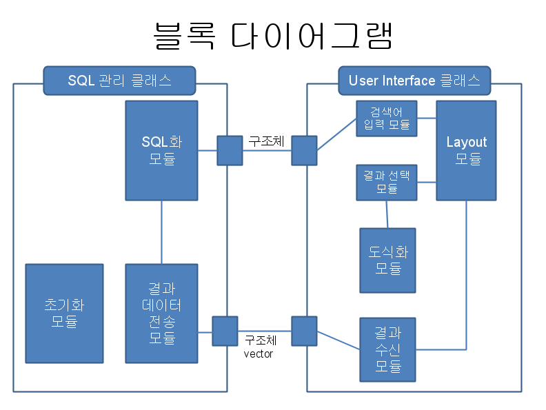
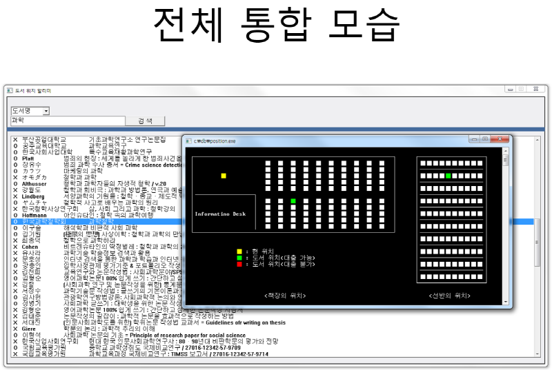

# BookNavigation

## 1. Why did we kick-off this project?
Whenever we visted the library, it is too difficult to find the book through book serial number. 

So we thought the idea to show the location of books visually.

## 2. Feature
This application provides two main services. 
+ Show the location of the bookself in the library. 
+ Show the location of book in the bookshelf. 

## 3. Enviroment
+ OS: Windows
+ Language: C++
+ DB: SQLite

## 4. Screenshot

